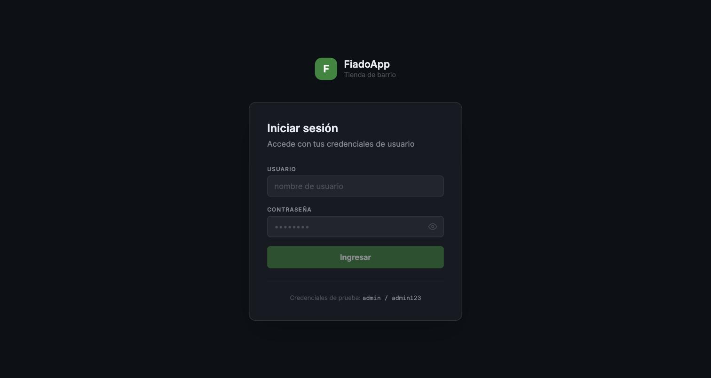
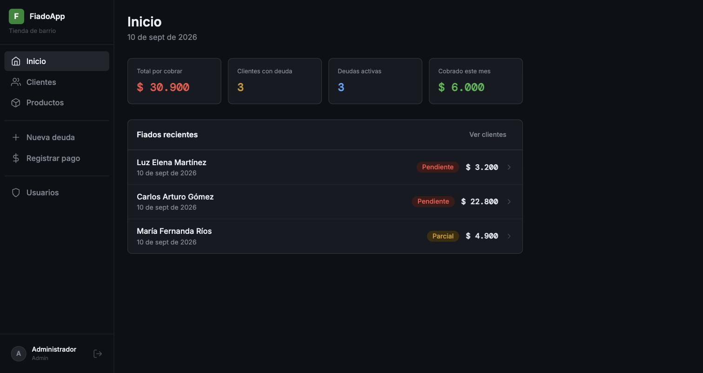

# FiadoApp

**Sistema de crédito fiado** para tiendas de barrio: registra clientes, fía productos, cobra saldos y controla quién debe qué, con abonos parciales o pagos completos.


**Demo en vivo:** [sistema-de-credito-fiado-frontend.onrender.com](https://sistema-de-credito-fiado-frontend.onrender.com) · **API docs:** [sistema-de-credito-fiado.onrender.com/docs](https://sistema-de-credito-fiado.onrender.com/docs)

<p align="center">
  
  
</p>

## Qué hace

- **Clientes**: alta, búsqueda y saldo consolidado por persona.
- **Deudas (fiados)**: se arman con varias líneas de producto; el total se calcula solo, en el backend.
- **Pagos**: un abono se puede repartir entre varias deudas pendientes de un mismo cliente.
- **Estado en tiempo real**: cada deuda queda como *pendiente*, *parcial* o *pagada* según lo que ya se abonó, sin recalcular nada a mano.
- **Usuarios y roles**: administradores gestionan el catálogo y el equipo; vendedores operan el día a día.
- **Auditoría**: toda la información queda con fecha de creación y de última modificación.

## Arquitectura

Monolito de dos partes en el mismo repositorio:

| | |
| --- | --- |
| **Frontend** | React 19 + TypeScript + Vite + Tailwind, en la raíz del repo |
| **Backend** | Python + FastAPI + PostgreSQL (Neon), en [`backend/`](backend/README.md) |

El frontend no guarda datos de negocio en memoria: cada pantalla llama directamente a la API (`src/lib/api.ts`) y el backend calcula saldos, totales y valida las reglas de negocio (ver el [diccionario de datos y las reglas](backend/README.md) del backend).

## Desarrollo local

```bash
npm install
npm run dev
```

Por defecto el frontend apunta al backend desplegado en Render. Para usar un backend local, crea un `.env` (ver `.env.example`):

```env
VITE_API_URL=http://127.0.0.1:8000
```

Comandos de calidad:

```bash
npm run lint
npm run build
```

Instrucciones del backend (instalación, base de datos, variables de entorno) en [`backend/README.md`](backend/README.md).

## Estructura del frontend

- `src/domain/types.ts`: tipos compartidos (usuario, roles, vistas, estado de deuda).
- `src/lib/api.ts`: cliente HTTP hacia el backend (auth, usuarios, productos, clientes, deudas, pagos, historial).
- `src/lib/formatters.ts`: fechas y moneda para presentación.
- `src/components/ui`: controles visuales reutilizables (`Btn`, `Card`, campos y estados).
- `src/components/icons`: iconos SVG usados por la interfaz.
- `src/app/useAppState.ts`: sesión y navegación entre vistas.
- `src/layout/AppShell.tsx`: sidebar, navegación móvil, usuario actual y logout.
- `src/features`: una carpeta por flujo funcional; cada pantalla carga sus propios datos del backend.
- `src/App.tsx`: composición de vistas; no debe contener JSX de pantallas ni reglas de negocio.

## Mapa de funcionalidades

| Necesidad | Archivo principal |
| --- | --- |
| Inicio y métricas | `src/features/dashboard/Dashboard.tsx` |
| Listar y crear clientes | `src/features/clientes/ClientesList.tsx` |
| Ver deudas y pagos de un cliente | `src/features/clientes/ClienteDetalle.tsx` |
| Crear una deuda | `src/features/deudas/NuevaDeuda.tsx` |
| Registrar y distribuir un pago | `src/features/pagos/RegistrarPago.tsx` |
| Crear, editar y eliminar productos | `src/features/productos/ProductosCatalogo.tsx` |
| Iniciar sesión | `src/features/auth/LoginView.tsx` |
| Gestionar usuarios | `src/features/usuarios/UsuariosAdmin.tsx` |

Para añadir una funcionalidad, crea o modifica la feature correspondiente, agrega tipos/llamadas en `lib/api.ts` si hace falta, y conecta la navegación en `App.tsx`. Evita poner reglas financieras o JSX de pantallas dentro de `App.tsx`.
